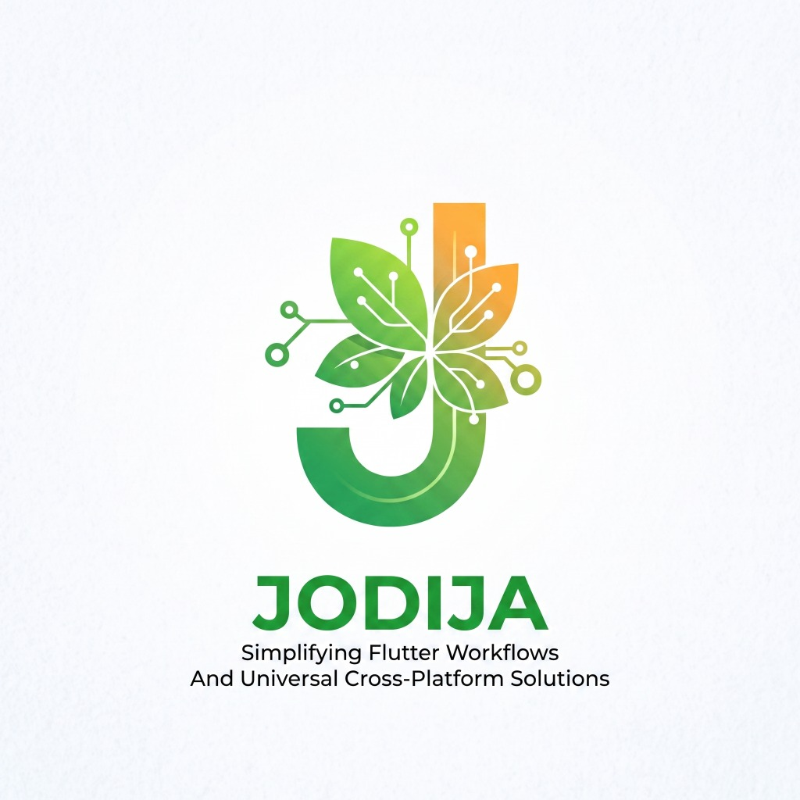
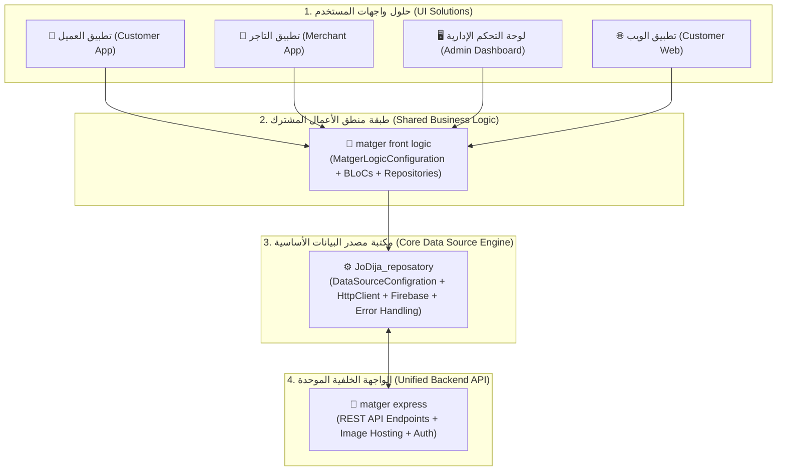

<div align="center">



# 🚀 مستودع جوديجا (`JoDija_reposatory`)

### *Simplifying Flutter Workflows And Universal Cross-Platform Solutions*

**إطار عمل شامل واحترافي لإدارة تدفق البيانات والشبكات وطبقة المستودع (Repository Layer) لتطبيقات Flutter و Dart للحلول الأحادية والأنظمة متعددة الحلول.**

[](pubspec.yaml)
[](https://flutter.dev)
[](https://dart.dev)
[](documents/ar/introduction_ar.md)

---

### 🌐 اللغة / Language
[🇺🇸 **English Version (README.md)**](README.md) • **العربية** • [📚 **بوابة التوثيق الكاملة (documents/README.md)**](documents/README.md)

---

</div>

## 💡 الفلسفة المعمارية الأساسية للمكتبة

تم بناء الفلسفة المعمارية لمستودع جوديجا للإجابة على تحدٍ هندسي أساسي: **كيف نشارك منطق الأعمال (Business Logic)، ونماذج البيانات (Data Models)، وتكامل الـ APIs عبر عدة تطبيقات ومنصات دون تكرار الأكواد ودون ربط الواجهات بتفاصيل الشبكات وقواعد البيانات؟**



### 1. معمارية تعدد الحلول (Multi-Solution Architecture) - نموذج `matger front logic`
- **المشكلة**: في الأنظمة الكبيرة مثل منصة **متجر (Matger)**، توجد عدة واجهات مستقلة (تطبيق عميل، تطبيق تاجر، لوحة تحكم، ويب) تشترك جميعها في نفس الخادم ونفس قواعد العمل.
- **الحل**:
  - **`JoDija_reposatory` (المحرك الأساسي)**: يعزل تفاصيل الشبكات، والـ Caching، والـ Serialization، ومعالجة الأخطاء.
  - **`matger front logic` (العقل المشترك)**: يرث `DataSourceConfigration`، ويدير الحالات (BLoCs)، ويزامن التوكن وترويسة اللغة `x-lang` لكافة الواجهات.
  - **حلول واجهات المستخدم (UI Solutions)**: تطبيقات Flutter لكل منصة تركز بنسبة 100% على الـ UI/UX وتعتمد على `matger front logic`.
  - **`matger express` (الواجهة الخلفية الموحدة)**: خادم Express موحد يقدم الـ Endpoints بعقد JSON موحد ويستجيب لترويسات اللغة `x-lang` والمصادقة `Authorization`.

### 2. معمارية الحل الأحادي (Single-Solution Architecture)
- **التطبيقات المستقلة**: في حال بناء تطبيق بواجهة واحدة فقط (مثل تطبيق جوال مستقل)، تعتمد حزمة التطبيق مباشرة على `JoDija_reposatory` وتقوم بتهيئة `DataSourceConfigration` داخل التطبيق نفسه بدون طبقات وسيطة.

---

## 🌟 المزايا والقدرات الأساسية للمكتبة

### 1. ⚙️ محرك إدارة البيئات المتعددة (`DataSourceConfigration`)
- **التبديل السلس بين البيئات**: التبديل الفوري بين حالات `local` و `remote_dev` و `remote_prod`.
- **دعم خوادم الصور المنفصلة**: دعم عناوين مستقلة لخادم الـ API (`baseUrls`) وخادم الصور والوسائط (`imageBaseUrls`).
- **التهيئة عبر ملف JSON**: تهيئة الروابط والـ Firebase بملف asset واحد عبر دالة `backendRoutedInit()`.
- **الضبط البرمجي المباشر**: إمكانية التعديل أثناء التشغيل عبر `setToHttpUrlsEnveiroment()`.

### 2. 🌐 عميل HTTP متقدم مع Dio (`HttpClient`)
- **دعم الطرق الخمس**: دعم كامل لـ `GET`, `POST`, `PUT`, `DELETE`, و `PATCH`.
- **الحقن التلقائي لترويسة اللغة**: إرسال `x-lang: ar` أو `x-lang: en` تلقائياً مع كل طلب عبر `HttpHeader().setLangHeader()`.
- **ربط توكن المصادقة التلقائي**: إرفاق `Authorization: Bearer <token>` تلقائياً عند تفعيل `userToken: true`.
- **رفع الملفات والصور وإلغاء الطلبات**: دعم قوي للـ Multipart والـ `CancelToken`.

### 3. 🛡️ منظومة معالجة الأخطاء الصارمة (`BaseError`)
- تصنيف كافة أخطاء الخادم والشبكة إلى 13 كلاس خطأ متخصص:
  - `400 BadRequestError` • `401 UnauthorizedError` • `403 ForbiddenError`
  - `404 NotFoundError` • `409 ConflictError` • `500 InternalServerError`
  - `TimeoutError` • `ConnectionError` • `SocketError` • `FormatError` • `CancelError`

### 4. 📦 نمط تغليف الحالات (`Result<Error, Data>`)
- منع انهيار التطبيق أثناء التشغيل عبر كبسلة النتائج في كائنات `Result<T>` و `UserResult` الآمنة.

### 5. 🔥 التكامل مع منظومة Firebase (Firestore, Storage, Auth, FCM)
- **عمليات Firestore**: موصلات جاهزة للـ CRUD والـ Real-time Streaming (`StreamFirebaseDataSource`).
- **التخزين السحابي**: رفع وإدارة الصور والملفات عبر `StorageActions`.
- **المصادقة**: دعم جاهز للمصادقة عبر Google و Email/Password.
- **الإشعارات الفورية**: إعداد واستقبال إشعارات Firebase Cloud Messaging عبر `FCMService`.

### 6. 📊 نظام التسجيل المتقدم وتتبع الأداء (`JDRepoConsole`)
- مخرجات ملونة ومؤرخة بـ 5 مستويات (`ERROR`, `WARN`, `INFO`, `DEBUG`, `SUCCESS`).
- قياس أزمنة التنفيذ بالمللي ثانية (`JDRepoConsole.performance()`).
- تثبيط السجلات غير الضرورية تلقائياً في وضع الإنتاج (`kReleaseMode`).

### 7. 📑 نماذج الجداول والخلايا الديناميكية (`Cell Models`)
- هياكل بيانات متخصصة (`Cell<T>`, `RowofCells<T>`, `TableOfCells<T>`) للجداول وشاشات الإدارة.

---

## 🚀 البدء السريع (Quick Start)

### 1. التثبيت
أضف المكتبة إلى ملف `pubspec.yaml`:

```yaml
dependencies:
  JoDija_reposatory:
    git:
      url: https://github.com/zeftawyapps/JoDija_reposatory.git
      ref: v1.7.0
```

### 2. إعداد ملف البيئات (`assets/config/config.json`)

```json
{
  "baseUrls": {
    "local": "http://10.0.2.2:5000/api/v1",
    "remote_dev": "https://dev-api.matger.com/api/v1",
    "remote_prod": "https://api.matger.com/api/v1"
  },
  "imageBaseUrls": {
    "local": "http://10.0.2.2:5000/",
    "remote_dev": "https://dev-api.matger.com/",
    "remote_prod": "https://api.matger.com/"
  },
  "firebaseConfig": {
    "dev": {
      "apiKey": "AIzaSyDev...",
      "appId": "1:12345:android:dev",
      "messagingSenderId": "123456789",
      "projectId": "matger-dev",
      "storageBucket": "matger-dev.appspot.com"
    },
    "prod": {
      "apiKey": "AIzaSyProd...",
      "appId": "1:12345:android:prod",
      "messagingSenderId": "987654321",
      "projectId": "matger-prod",
      "storageBucket": "matger-prod.appspot.com"
    }
  }
}
```

### 3. التهيئة عند إقلاع التطبيق

```dart
import 'package:flutter/material.dart';
import 'package:JoDija_reposatory/jodija_configration.dart';
import 'package:JoDija_reposatory/https/http_urls.dart';
import 'package:JoDija_reposatory/utilis/functions/jd_repo_console.dart';

void main() async {
  WidgetsFlutterBinding.ensureInitialized();

  // 1. تهيئة الإعدادات من ملف الـ JSON
  final config = AppConfiguration();
  config.envType = EnvType.dev;
  config.backendState = BackendState.remote_dev;
  config.appType = AppType.App;
  
  await config.backendRoutedInit('assets/config/config.json');

  // 2. ضبط ترويسة اللغة الافتراضية
  HttpHeader().setLangHeader(lang: 'ar');

  JDRepoConsole.success('تمت تهيئة مستودع جوديجا بنجاح');

  runApp(const MyApp());
}

class AppConfiguration extends DataSourceConfigration {}
```

---

## 📖 بوابة التوثيق الكاملة

| الوثيقة | الوصف |
| :--- | :--- |
| 📄 **[المقدمة الشاملة باللغة العربية](documents/ar/introduction_ar.md)** | الشرح المفصل لفلسفة المكتبة المعمارية وطبقاتها. |
| 🛠️ **[دليل التكامل مع متجر](documents/ar/integration_matger_guide_ar.md)** | الدليل العملي لربط `matger front logic` مع `matger express`. |
| 🌐 **[English Documentation Portal](documents/en/README.md)** | بوابة التوثيق باللغة الإنجليزية. |
| ⚙️ **[فئات التهيئة (Configuration)](documents/en/classes/configration.md)** | توثيق إدارة البيئات والروابط والـ Firebase. |
| 🌐 **[عميل الـ HTTP والترويسات](documents/en/classes/utils/JodijaHttpClient.md)** | طلبات الشبكة وترويسات اللغة والمصادقة. |
| 🖥️ **[نظام التسجيل (JDRepoConsole)](documents/en/classes/utils/JDRepoConsole.md)** | السجلات الملونة وتتبع الأداء. |
| 🛡️ **[هرمية معالجة الأخطاء (HttpErrors)](documents/en/classes/utils/HttpErrors.md)** | كلاسات أخطاء الشبكة والتعامل مع الاستجابات. |
| 📚 **[فهرس وتفاصيل جميع الفئات](documents/en/classes/class_summary.md)** | الفهرس المرجعي لكافة الكلاسات والـ Interfaces. |

---

## 📄 الترخيص (License)

هذا المشروع مرخص بموجب ترخيص MIT - راجع ملف [LICENSE](LICENSE) لمزيد من التفاصيل.
