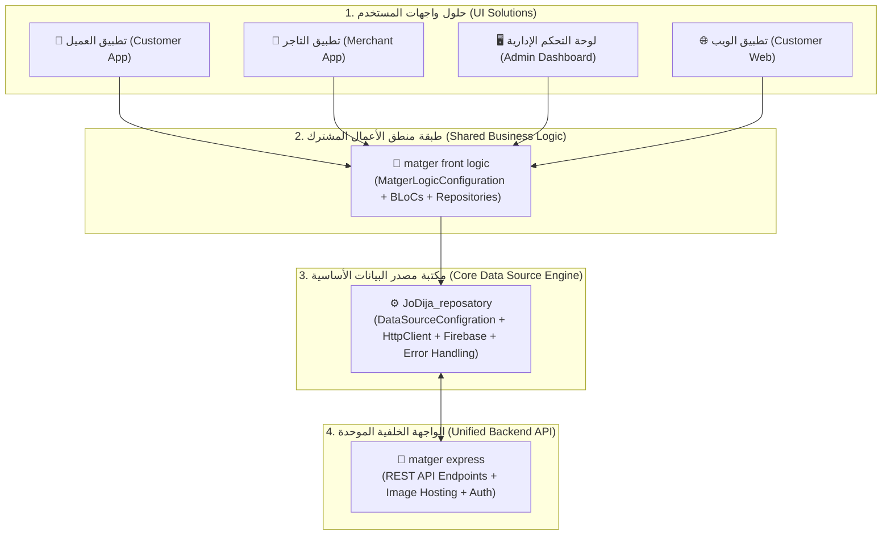

<div align="center">


# 🚀 Jodija Repository (`JoDija_reposatory`)

### *Simplifying Flutter Workflows And Universal Cross-Platform Solutions*

**An enterprise-grade Flutter/Dart data management, networking, and repository layer framework for Single-Solution and Multi-Solution architectures.**

[](pubspec.yaml)
[](https://flutter.dev)
[](https://dart.dev)
[](documents/en/introduction_en.md)

---

### 🌐 Language / اللغة
**English** • [🇸🇦 **العربية (README.ar.md)**](README.ar.md) • [📚 **Documentation Portal (documents/README.md)**](documents/README.md)

---

</div>

## 💡 The Core Architectural Philosophy (فلسفة المكتبة الأساسية)

The foundational philosophy of JoDija Repository was created to solve a critical software engineering challenge: **How to share domain business logic, data models, and API integrations across multiple applications without duplicating code or coupling UI to networking details.**



### 1. Multi-Solution Architecture (التطبيقات متعددة الحلول) - e.g., `matger front logic`
- **The Problem**: In modern platforms like **Matger (متجر)**, you have multiple user-facing clients (Customer Mobile App, Merchant App, Web Dashboard, Delivery App) that all interact with the same database and share identical business rules.
- **The Solution**: 
  - **`JoDija_reposatory` (The Engine)**: Handles networking, caching, serialization, and error mapping.
  - **`matger front logic` (The Shared Brain)**: Inherits `DataSourceConfigration`, manages state (BLoCs/Cubits), synchronizes auth tokens and `x-lang` language codes, and exposes clean use cases.
  - **UI Solutions (The Presentation)**: Flutter apps for iOS, Android, Web, and Desktop focus 100% on UI/UX and consume `matger front logic`.
  - **`matger express` (The Unified Backend)**: Serves all clients through a standard JSON contract and respects `x-lang` and `Authorization` headers.

### 2. Single-Solution Architecture (التطبيقات أحادية الحل)
- **Standalone Apps**: When building a single application (e.g. standalone mobile app), the app package depends directly on `JoDija_reposatory` and configures `DataSourceConfigration` inside its own startup lifecycle with zero boilerplate.

---

## 🌟 Core Features & Capabilities (المزايا والقدرات الأساسية)

### 1. ⚙️ Multi-Environment Configuration Engine (`DataSourceConfigration`)
- **Seamless Environment Switching**: Effortlessly toggle between `local`, `remote_dev`, and `remote_prod` states.
- **Dedicated Image Server Routing**: Independent resolution for API base URLs (`baseUrls`) and media/image server URLs (`imageBaseUrls`).
- **JSON-Driven Setup**: Bootstrap complete networking and Firebase environments from a single asset file via `backendRoutedInit()`.
- **Programmatic Override**: Direct runtime updates via `setToHttpUrlsEnveiroment()`.

### 2. 🌐 Advanced HTTP Client with Dio (`HttpClient`)
- **Full HTTP Method Suite**: Native support for `GET`, `POST`, `PUT`, `DELETE`, and `PATCH`.
- **Automated Localization**: Dynamic language header injection (`x-lang: ar` / `x-lang: en`) managed globally via `HttpHeader().setLangHeader()`.
- **Automatic JWT Bearer Token**: Seamless authentication header binding (`Authorization: Bearer <token>`).
- **Multipart Uploads & Cancellations**: First-class handling of file uploads and request cancellation via `CancelToken`.

### 3. 🛡️ Strongly-Typed Error Handling Hierarchy (`BaseError`)
- Automatic conversion of HTTP status codes and connection failures into 13+ strongly typed error classes:
  - `400 BadRequestError` • `401 UnauthorizedError` • `403 ForbiddenError`
  - `404 NotFoundError` • `409 ConflictError` • `500 InternalServerError`
  - `TimeoutError` • `ConnectionError` • `SocketError` • `FormatError` • `CancelError`

### 4. 📦 Result Pattern State Encapsulation (`Result<Error, Data>`)
- Eliminates unhandled runtime exceptions by encapsulating outcomes into type-safe `Result<T>` and `UserResult` objects.

### 5. 🔥 Firebase Ecosystem Integration (Firestore, Storage, Auth, FCM)
- **Firestore CRUD**: High-level and low-level Firestore connectors (`DataSourceFirebaseSource`, `FireStoreAction`).
- **Real-Time Streaming**: Reactive Firestore streaming with automatic model mapping (`StreamFirebaseDataSource`).
- **Storage Utilities**: Integrated image and file uploads to Firebase Storage (`StorageActions`).
- **Authentication**: Pre-built providers for Google Sign-In (`GoogleAuthSoucre`) and Email/Password (`EmailPassowrdAuthSource`).
- **Push Notifications**: Firebase Cloud Messaging setup and topic subscriptions (`FCMService`).

### 6. 📊 Enterprise Logging & Performance Diagnostics (`JDRepoConsole`)
- **Colorized Output**: Distinct console styling with timestamps and icons for 5 log levels (`ERROR`, `WARN`, `INFO`, `DEBUG`, `SUCCESS`).
- **Execution Profiling**: Built-in performance timers (`JDRepoConsole.performance()`).
- **Smart Release Mode**: Suppresses verbose debug logs in production (`kReleaseMode`) automatically.

### 7. 📑 Dynamic Data Grid & Table Models (`Cell Models`)
- Specialized data structures (`Cell<T>`, `RowofCells<T>`, `TableOfCells<T>`) for dashboards, data tables, and dynamic forms.

---

## 🚀 Quick Start

### 1. Installation

Add `JoDija_reposatory` to your `pubspec.yaml`:

```yaml
dependencies:
  JoDija_reposatory:
    git:
      url: https://github.com/zeftawyapps/JoDija_reposatory.git
      ref: v1.7.0
```

### 2. Configuration (`assets/config/config.json`)

Create an environment configuration file:

```json
{
  "baseUrls": {
    "local": "http://10.0.2.2:5000/api/v1",
    "remote_dev": "https://dev-api.matger.com/api/v1",
    "remote_prod": "https://api.matger.com/api/v1"
  },
  "imageBaseUrls": {
    "local": "http://10.0.2.2:5000/",
    "remote_dev": "https://dev-api.matger.com/",
    "remote_prod": "https://api.matger.com/"
  },
  "firebaseConfig": {
    "dev": {
      "apiKey": "AIzaSyDev...",
      "appId": "1:12345:android:dev",
      "messagingSenderId": "123456789",
      "projectId": "matger-dev",
      "storageBucket": "matger-dev.appspot.com"
    },
    "prod": {
      "apiKey": "AIzaSyProd...",
      "appId": "1:12345:android:prod",
      "messagingSenderId": "987654321",
      "projectId": "matger-prod",
      "storageBucket": "matger-prod.appspot.com"
    }
  }
}
```

### 3. Bootstrap in App Startup

```dart
import 'package:flutter/material.dart';
import 'package:JoDija_reposatory/jodija_configration.dart';
import 'package:JoDija_reposatory/https/http_urls.dart';
import 'package:JoDija_reposatory/utilis/functions/jd_repo_console.dart';

void main() async {
  WidgetsFlutterBinding.ensureInitialized();

  // 1. Initialize configuration from asset
  final config = AppConfiguration();
  config.envType = EnvType.dev;
  config.backendState = BackendState.remote_dev;
  config.appType = AppType.App;
  
  await config.backendRoutedInit('assets/config/config.json');

  // 2. Set default language header
  HttpHeader().setLangHeader(lang: 'ar');

  JDRepoConsole.success('JoDija Repository successfully initialized');

  runApp(const MyApp());
}

class AppConfiguration extends DataSourceConfigration {}
```

---

## 📖 Complete Documentation Portal

Explore detailed guides and reference documentation:

| Document | Description |
| :--- | :--- |
| 📄 **[Arabic Introduction (مقدمة باللغة العربية)](documents/ar/introduction_ar.md)** | الشرح الكامل لفلسفة المكتبة وطبقاتها باللغة العربية. |
| 📄 **[English Introduction](documents/en/introduction_en.md)** | Overview of layered architecture and core principles. |
| 🛠️ **[Matger Integration Guide (دليل التكامل مع متجر)](documents/ar/integration_matger_guide_ar.md)** | الدليل العملي لربط `matger front logic` مع `matger express`. |
| 🛠️ **[English Matger Integration Guide](documents/en/integration_matger_guide.md)** | Multi-solution integration guide for Matger business logic & Express backend. |
| ⚙️ **[DataSourceConfiguration](documents/en/classes/configration.md)** | Environment routing, image URLs, and Firebase initialization. |
| 🌐 **[HttpClient & HttpHeader](documents/en/classes/utils/JodijaHttpClient.md)** | Network requests (GET, POST, PUT, DELETE, PATCH) and language/auth headers. |
| 🖥️ **[JDRepoConsole Logging](documents/en/classes/utils/JDRepoConsole.md)** | Colored console logging, execution timing, and diagnostics. |
| 🛡️ **[HTTP Error Hierarchy](documents/en/classes/utils/HttpErrors.md)** | Strongly typed `BaseError` subclasses and failure handling. |
| 📚 **[Comprehensive Class Summary](documents/en/classes/class_summary.md)** | Full breakdown of all repository interfaces and connectors. |

---

## 📄 License

This project is licensed under the MIT License - see the [LICENSE](LICENSE) file for details.
