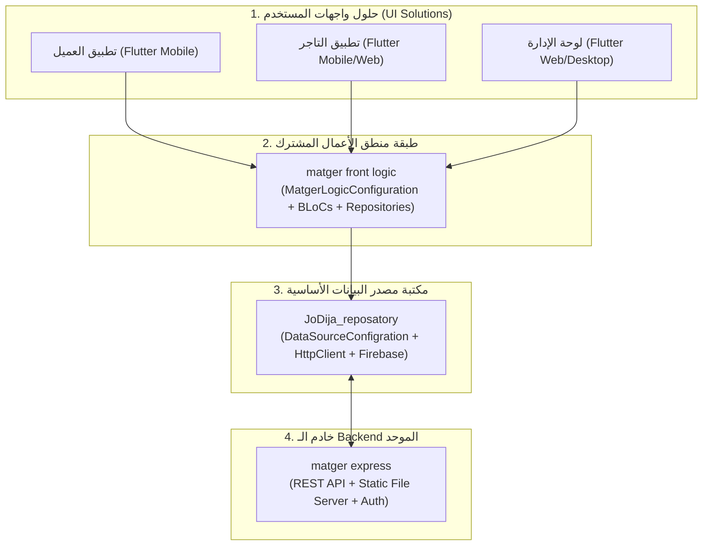

# دليل التكامل الشامل: بين مكتبة المستودع (JoDija_reposatory) وحزمة منطق الأعمال (matger front logic) وخادم (matger express)

[English Version](../en/integration_matger_guide.md) | **العربية**

هذا الدليل يشرح **الفلسفة المعمارية** لكيفية بناء التطبيقات والأنظمة المتكاملة في بيئة عمل جوديجا (JoDija Ecosystem)، وكيف تترابط الطبقات الثلاث لتقديم نظام عالي القابلية للتوسع وإعادة الاستخدام.

---

## 1. الفلسفة المعمارية: لماذا تعدد الحلول (Multi-Solution Architecture)؟

في المشاريع الواقعية الكبيرة (مثل منصة **متجر Matger**)، لا يحتوي النظام على تطبيق واحد فقط، بل يتكون عادةً من:
- **تطبيق العميل (Customer Mobile App)**
- **تطبيق التاجر (Merchant Mobile / Web App)**
- **لوحة التحكم الإدارية (Admin Dashboard)**
- **تطبيق مندوب التوصيل (Delivery App)**
- **موقع الويب للعملاء (Customer Web App)**

### المبدأ الأساسي: عزل منطق الأعمال عن واجهات العرض
بدلاً من إعادة كتابة نماذج البيانات (Data Models)، وإدارة الحالات (State Management/BLoC)، وعمليات التحقق، واستدعاءات الـ APIs في كل تطبيق بشكل منفصل، تم تقسيم النظام إلى 4 طبقات مستقلة:



---

## 2. دور كل طبقة ومسؤولياتها

| الطبقة | الحزمة / المشروع | المسؤوليات |
| :--- | :--- | :--- |
| **طبقة مصدر البيانات (Core Data Layer)** | `JoDija_reposatory` | - تجريد طلبات الشبكة (`HttpClient`) وتخزين Firebase.<br/>- تحويل الـ JSON إلى نماذج `BaseEntityDataModel`.<br/>- معالجة الأخطاء الموحدة (`BaseError` و `Result`).<br/>- إدارة بيئات الـ URLs والـ Headers والـ Console. |
| **طبقة منطق الأعمال (Shared Logic Layer)** | `matger front logic` | - وراثة `DataSourceConfigration` لإدارة إعدادات المتجر.<br/>- توفير الـ BLoCs/Cubits وقواعد الأعمال المشتركة.<br/>- مزامنة التوكن واللغة عبر `HttpHeader`.<br/>- استهلاك الـ Repositories من `JoDija_reposatory`. |
| **حلول واجهات المستخدم (UI Solutions)** | تطبيقات Flutter المتعددة | - بناء الـ Widgets وتجربة المستخدم (UI/UX).<br/>- الاستماع إلى الـ BLoC States وعرض البيانات.<br/>- تزويد `matger front logic` بملف الـ `config.json` المناسب للمنصة. |
| **الواجهة الخلفية الموحدة (Backend API)** | `matger express` | - توفير الـ Endpoints وفق عقد الـ API الموحد.<br/>- قراءة ترويسة اللغة `x-lang` والتوثيق `Authorization`.<br/>- تقديم مسارات الصور والملفات المرفوعة (`imageBaseUrls`). |

---

## 3. خطوات التكامل والتطبيق العملي

### الخطوة 1: إعداد ملف الإعدادات (`assets/config/config.json`) في تطبيقات الـ UI
يقوم كل تطبيق واجهة بتضمين ملف إعدادات يحدد روابط البيئات المختلفة:

```json
{
  "baseUrls": {
    "local": "http://10.0.2.2:5000/api/v1",
    "remote_dev": "https://dev-api.matger.com/api/v1",
    "remote_prod": "https://api.matger.com/api/v1"
  },
  "imageBaseUrls": {
    "local": "http://10.0.2.2:5000/",
    "remote_dev": "https://dev-api.matger.com/",
    "remote_prod": "https://api.matger.com/"
  },
  "firebaseConfig": {
    "dev": {
      "apiKey": "AIzaSyDevKey...",
      "appId": "1:12345:android:dev",
      "messagingSenderId": "123456789",
      "projectId": "matger-dev",
      "storageBucket": "matger-dev.appspot.com"
    },
    "prod": {
      "apiKey": "AIzaSyProdKey...",
      "appId": "1:12345:android:prod",
      "messagingSenderId": "987654321",
      "projectId": "matger-prod",
      "storageBucket": "matger-prod.appspot.com"
    }
  }
}
```

---

### الخطوة 2: تطبيق الـ Configuration داخل `matger front logic`
في حزمة `matger front logic`، ننشئ كلاس التهيئة المركزي:

```dart
import 'package:JoDija_reposatory/jodija_configration.dart';
import 'package:JoDija_reposatory/https/http_urls.dart';
import 'package:JoDija_reposatory/utilis/functions/jd_repo_console.dart';

class MatgerLogicConfiguration extends DataSourceConfigration {
  static final MatgerLogicConfiguration _instance = MatgerLogicConfiguration._internal();
  factory MatgerLogicConfiguration() => _instance;
  MatgerLogicConfiguration._internal();

  /// التهيئة الشاملة عند إقلاع أي تطبيق واجهة
  Future<void> initializeApp({
    required String configAssetPath,
    required EnvType env,
    required BackendState backend,
    required AppType app,
    String defaultLanguage = 'ar',
  }) async {
    envType = env;
    backendState = backend;
    appType = app;

    JDRepoConsole.info('Initializing Matger Logic for App: $app in $backend state');

    // 1. قراءة الروابط ومسارات الصور تلقائياً
    await backendRoutedInit(configAssetPath);

    // 2. ضبط ترويسة اللغة التلقائية
    HttpHeader().setLangHeader(lang: defaultLanguage);

    JDRepoConsole.success('Matger Logic Initialized with BaseUrl: ${HttpUrlsEnveiroment().baseUrl}');
  }

  /// تغيير لغة الطلبات وتزامنها مع التطبيق بالكامل
  void setLanguage(String langCode) {
    HttpHeader().setLangHeader(lang: langCode);
    JDRepoConsole.info('Language header updated to: $langCode');
  }

  /// حفظ التوكن عند تسجيل الدخول
  void setAuthToken(String token) {
    HttpHeader().setAuthHeader(token, Bearer: 'Bearer ');
    JDRepoConsole.info('Auth token registered in HttpHeader');
  }

  /// مسح التوكن عند تسجيل الخروج
  void clearAuthToken() {
    HttpHeader().setAuthHeader('');
  }

  /// دالة مساعدة للحصول على رابط الصورة الكامل
  String getFullImageUrl(String relativeImagePath) {
    if (relativeImagePath.startsWith('http')) return relativeImagePath;
    final imageBase = HttpUrlsEnveiroment().imageBaseUrl ?? '';
    return '$imageBase$relativeImagePath';
  }
}
```

---

### الخطوة 3: إقلاع التطبيق في حلول واجهات المستخدم (UI Solutions)
في ملف `main.dart` الخاص بتطبيق العميل أو لوحة الإدارة:

```dart
void main() async {
  WidgetsFlutterBinding.ensureInitialized();

  // تهيئة منطق العمل للمتجر
  await MatgerLogicConfiguration().initializeApp(
    configAssetPath: 'assets/config/config.json',
    env: EnvType.dev,
    backend: BackendState.remote_dev,
    app: AppType.App, // أو AppType.DashBord في لوحة التحكم
    defaultLanguage: 'ar',
  );

  runApp(const MatgerCustomerApp());
}
```

---

### الخطوة 4: التوافق مع خادم `matger express` (Express.js Backend API)

لكي يعمل خادم `matger express` بسلاسة مع `JoDija_reposatory` و `matger front logic`، يجب أن يلتزم بالقواعد التالية:

#### 1. هيكل الاستجابة الموحد (Unified JSON Response Contract)
يجب أن ترجع جميع الـ endpoints بصيغة قياسية تقبلها نماذج `RemoteBaseModel` و `HttpClient`:

```json
{
  "success": true,
  "message": "تم جلب بيانات المنتجات بنجاح",
  "data": [
    {
      "id": "prod_001",
      "title": "قميص قطني",
      "price": 250.0,
      "image": "uploads/products/shirt.png"
    }
  ],
  "timestamp": "2026-08-28T22:30:00.000Z"
}
```

#### 2. معالجة الترويسات (Headers Handling في Express)
- **ترويسة اللغة (`x-lang`)**:
  يقوم `HttpHeader().setLangHeader()` بإرسال الترويسة `x-lang: ar` أو `x-lang: en`.
  في Express:
  ```javascript
  app.use((req, res, next) => {
    const lang = req.headers['x-lang'] || 'ar';
    req.locale = lang;
    next();
  });
  ```
- **ترويسة التوثيق (`Authorization`)**:
  يقوم `HttpClient(userToken: true)` بإرسال الترويسة `Authorization: Bearer <TOKEN>`.
- **طرق الـ HTTP المدعومة**:
  الخادم يجب أن يدعم طرق `GET`, `POST`, `PUT`, `DELETE`, و `PATCH` (المضافة حديثاً للتحديث الجزئي).

#### 3. خادم الملفات والصور الثابتة
يجب أن يقدم خادم Express الصور على مسار متوافق مع `imageBaseUrls` (مثلاً: `http://api.matger.com/uploads/...`).

---

## 4. مقارنة سريعة: الحل الأحادي (Single-Solution) مقابل متعدد الحلول (Multi-Solution)

| وجه المقارنة | التطبيق أحادي الحلول (Single-Solution) | التطبيق متعدد الحلول (Multi-Solution) |
| :--- | :--- | :--- |
| **عدد الواجهات** | تطبيق واحد فقط (مثل Mobile فقط). | واجهات متعددة (عميل، تاجر، لوحة تحكم، ويب). |
| **موقع الـ Configuration** | يتم داخل حزمة التطبيق مباشرة. | يتم داخل حزمة `matger front logic` المشتركة. |
| **مشاركة الأكواد** | لا توجد حزمة وسيطة. | حزمة `front logic` تجمع كل الـ BLoCs والـ Repos. |
| **الصيانة والتطوير** | تعديل الكود يؤثر على تطبيق واحد. | أي تعديل في قواعد الأعمال ينعكس فوراً على جميع التطبيقات. |
