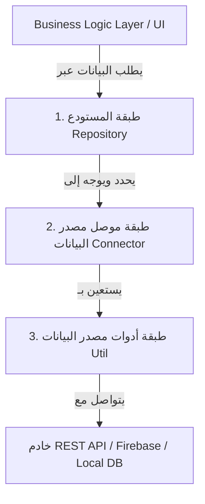

# مقدمة في مستودع جوديجا (JoDija Repository)

[English Version](../en/introduction_en.md) | **العربية**

## ما هو مستودع جوديجا؟
يدير `JoDija_reposatory` تدفق البيانات التي نستقبلها أو نرسلها إلى الخوادم عبر واجهات برمجة التطبيقات (APIs) أو منصات السحابة مثل Firebase. يعيد تشكيل البيانات لتتوافق مع منطق الأعمال لعرضها للمستخدم إذا كانت البيانات قادمة من الخادم، أو يقوم بتنسيقها كـ JSON عند إرسالها إلى الخوادم، مع توفير معالجة أخطاء مركزية وتسجيل أحداث متقدم.

---

## الفلسفة المعمارية للمكتبة

تنقسم المكتبة إلى ثلاث طبقات رئيسية تعزز فصل الاهتمامات (Separation of Concerns)، وقابلية الاختبار، والصيانة:



### 1. طبقة المستودع (Repository Layer)
- **الغرض:** تعمل كوسيط بين منطق الأعمال في التطبيق (مثل نماذج العرض، حالات الاستخدام، وإدارة الحالة BLoC) وطبقة البيانات (مصادر البيانات). توفر واجهة برمجية (API) نظيفة ومتسقة للوصول إلى البيانات، بغض النظر عن مصدر البيانات.
- **المسؤوليات:**
  - تجريد البيانات وتجميعها من مصادر متعددة.
  - معالجة الأخطاء وتحويلها إلى كائنات `Result` موحدة.
  - عزل التطبيق عن تغييرات الشبكة وقواعد البيانات.

### 2. طبقة موصل مصدر البيانات (Data Source Connector Layer)
- **الغرض:** مسؤولة عن التفاعل المباشر مع مصادر بيانات محددة (مثل REST API أو Firebase Firestore).
- **المسؤوليات:**
  - تنفيذ عمليات الـ CRUD والـ Streaming.
  - تحويل البيانات بين JSON ونماذج `BaseEntityDataModel`.
  - معالجة الأخطاء الخاصة بمصدر البيانات.

### 3. طبقة أداة مصدر البيانات (Data Source Util Layer)
- **الغرض:** توفر فئات وأدوات مساعدة منخفضة المستوى يستخدمها موصلو مصادر البيانات.
- **الأمثلة:**
  - `HttpClient`: لإجراء طلبات الشبكة (GET, POST, PUT, DELETE, PATCH).
  - `HttpHeader`: لإدارة التوكن وترويسات اللغة (`x-lang`).
  - `JDRepoConsole`: لتسجيل الأحداث وتتبع الأداء والـ Metadata.
  - `FirebaseLoadingData` و `StorageActions`: للتفاعل مع Firestore والتخزين السحابي.

---

## أنواع حلول التطبيقات (Single vs Multi-Solution)

بُنيت فلسفة مكتبة `JoDija_reposatory` لتلائم نوعين رئيسيين من بنية المشاريع:

### 1. التطبيقات متعددة الحلول (Multi-Solution Applications) - مثل `matger front logic`
- **الوصف:** عندما يتكون النظام من عدة واجهات أمامية لمنصات مختلفة (تطبيق جوال للعميل، تطبيق جوال للتاجر، لوحة تحكم ويب إدارية، موقع إلكتروني) تشترك جميعها في نفس الخادم ونفس قواعد العمل.
- **الهندسة المتبعة:**
  1. **حلول واجهات المستخدم (UI Solutions):** تطبيقات Flutter لكل منصة تركز فقط على الـ UI.
  2. **حزمة منطق الأعمال المشترك (مثل `matger front logic`):** تحتوي على الـ BLoCs والـ Repositories وترث `DataSourceConfigration`.
  3. **مصدر بيانات جوديجا (`JoDija_reposatory`):** الحزمة الأساسية للتعامل مع البيانات والشبكة.
  4. **الواجهة الخلفية الموحدة (مثل `matger express`):** خادم موحد يستقبل الطلبات ويرسل استجابات بصيغة قياسية.
- **الميزة:** أي تعديل في منطق الأعمال أو استدعاءات الـ API يتم في حزمة `front logic` وينعكس فوراً على جميع التطبيقات دون تكرار الكود.

### 2. التطبيقات أحادية الحل (Single-Solution Applications)
- **الوصف:** التطبيقات التي تحتوي على واجهة مستخدم واحدة فقط (مثل تطبيق جوال مستقل).
- **الهندسة المتبعة:**
  - تعتمد حزمة التطبيق مباشرة على `JoDija_reposatory`.
  - يتم تهيئة `DataSourceConfigration` داخل حزمة التطبيق نفسها دون الحاجة لحزمة منطق أعمال وسيطة.

---

## كيفية استخدام المكتبة

### 1. التثبيت
أضف المكتبة إلى ملف `pubspec.yaml`:

```yaml
dependencies:
  JoDija_reposatory:
    git:
      url: https://github.com/zeftawyapps/JoDija_reposatory.git
      ref: v1.7.0
```

### 2. الاستيراد
```dart
import 'package:JoDija_reposatory/jodija_configration.dart';
import 'package:JoDija_reposatory/https/http_urls.dart';
import 'package:JoDija_reposatory/reposetory/repsatory.dart';
```

### 3. التهيئة (Configuration)

#### أ. في التطبيقات متعددة الحلول (عبر `matger front logic`):
داخل حزمة منطق الأعمال، نقوم بوراثة `DataSourceConfigration`:

```dart
class LogicConfiguration extends DataSourceConfigration {
  Future<void> initLogic({
    required String configPath,
    required EnvType env,
    required BackendState backend,
    required AppType app,
    String defaultLang = 'ar',
  }) async {
    envType = env;
    backendState = backend;
    appType = app;

    await backendRoutedInit(configPath);
    HttpHeader().setLangHeader(lang: defaultLang);
  }
}
```

ثم في ملف `main.dart` لكل تطبيق واجهة (UI Solution):
```dart
void main() async {
  WidgetsFlutterBinding.ensureInitialized();
  await LogicConfiguration().initLogic(
    configPath: 'assets/config/config.json',
    env: EnvType.dev,
    backend: BackendState.remote_dev,
    app: AppType.App,
  );
  runApp(const MyApp());
}
```

#### ب. في التطبيقات أحادية الحل:
يتم إنشاء كلاس التهيئة مباشرة في التطبيق:
```dart
class AppConfiguration extends DataSourceConfigration {
  Future<void> init() async {
    envType = EnvType.dev;
    backendState = BackendState.remote_dev;
    appType = AppType.App;
    await backendRoutedInit('assets/config/config.json');
  }
}
```

---

## أدلة وروابط إضافية

- [دليل التكامل مع متجر (matger front logic & matger express)](integration_matger_guide_ar.md)
- [توثيق فئات التهيئة (Configuration)](../en/classes/configration.md)
- [توثيق فئات التسجيل والكونسول (JDRepoConsole)](../en/classes/utils/JDRepoConsole.md)
- [توثيق معالجة أخطاء الشبكة (Http Errors)](../en/classes/utils/HttpErrors.md)
- [فهرس وتفاصيل جميع الفئات (Class Summary)](../en/classes/class_summary.md)
