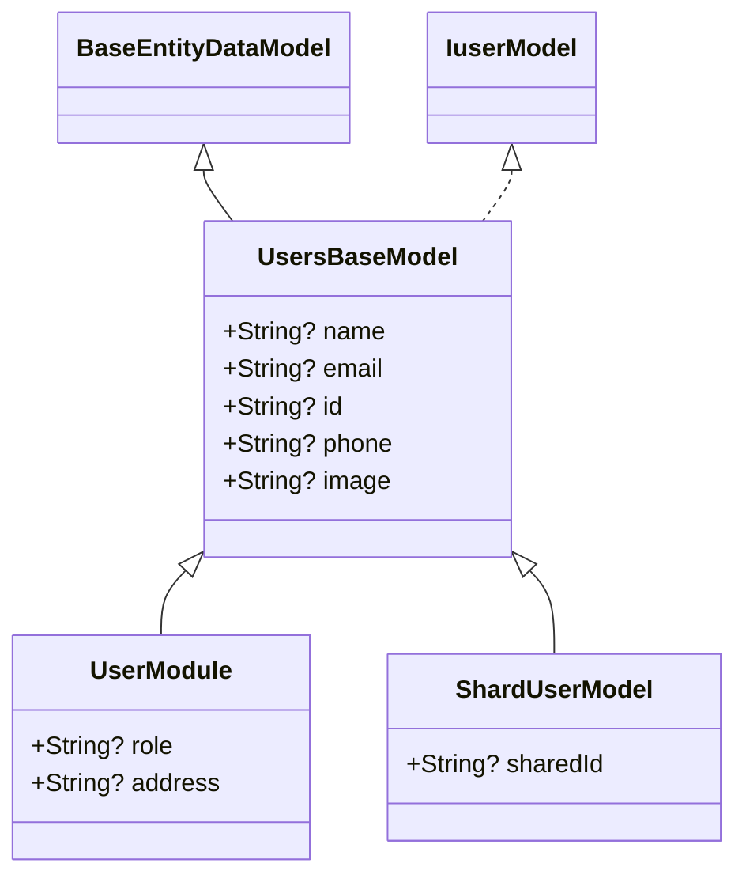

# BaseUsersRepo & User Management

`BaseUsersRepo` and related user source classes manage user accounts, user profiles, and sub-collection user actions across Firebase and HTTP.

---

## Architecture Overview

- **Interface**: `IBaseAccountActions`, `IProfileSubDataActions`, `IuserModel`
- **Models**: `UsersBaseModel`, `UserModule`, `ShardUserModel`
- **Sources**: `BaseUsersActionsSources` (Firebase), `ProfileActions` (Firebase), `AuthHttpSource` (HTTP)
- **Repositories**: `BaseUsersRepo`, `BaseProfilRebo`, `BaseAuthRepo`

---

## `BaseUsersRepo`

`BaseUsersRepo` manages user data collections and retrieving user lists.

### Constructors:
```dart
BaseUsersRepo({required BaseUsersActionsSources source});
```

### Methods:
- `getAllUsers()`: Retrieves a list of all registered users.
- `getUserById(String id)`: Retrieves a specific user profile by user ID.

---

## User Data Models Hierarchy



---

## Usage Example

```dart
import 'package:JoDija_reposatory/reposetory/user/users_repo.dart';
import 'package:JoDija_reposatory/source/user/accountLoginLogout/firebase/users_sourse.dart';

void loadUsers() async {
  final usersSource = BaseUsersActionsSources();
  final usersRepo = BaseUsersRepo(source: usersSource);

  final result = await usersRepo.getAllUsers();
  print('Users: $result');
}
```

---

## Related Classes

- [`BaseAuthRepo`](BaseAuthRepo.md): Manages login, registration, and authentication state.
- [`BaseProfilRebo`](BaseProfilRebo.md): Manages current user profile edits and sub-data.
