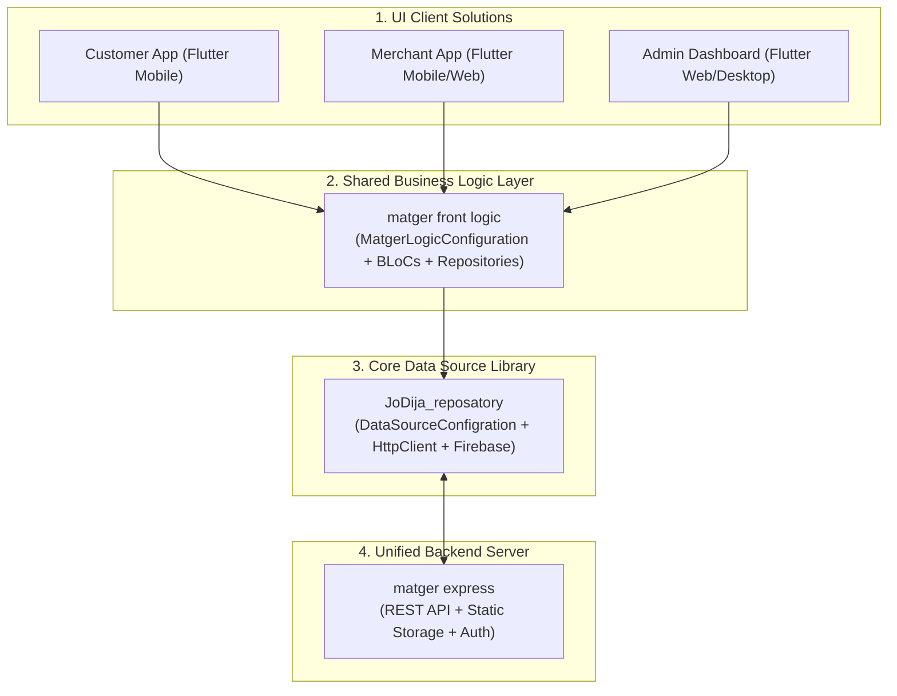

# Comprehensive Integration Guide: JoDija Repository, Business Logic (matger front logic), and Backend (matger express)

**English** | [النسخة العربية](../ar/integration_matger_guide_ar.md)

This guide documents the **Architectural Philosophy** and practical integration steps for the JoDija ecosystem, detailing how the three layers work synergistically to build robust, scalable Multi-Solution applications.

---

## 1. Architectural Philosophy: Why Multi-Solution Architecture?

In real-world enterprise platforms (such as the **Matger** platform), a single system comprises multiple user-facing clients:
- **Customer Mobile App** (Android / iOS)
- **Merchant Mobile / Web App**
- **Admin Management Dashboard** (Web / Desktop)
- **Delivery Courier App**
- **Customer Web Portal**

### Core Principle: Decoupling Data & Logic from UI Presentations
Instead of duplicating data models, HTTP calls, BLoC state management, and validations across 5 separate applications, the system is separated into 4 cleanly decoupled layers:



---

## 2. Layer Responsibilities & Roles

| Layer | Package / Module | Primary Responsibilities |
| :--- | :--- | :--- |
| **Core Data Layer** | `JoDija_reposatory` | - Abstracts HTTP (`HttpClient`) and Firebase calls.<br/>- Parses JSON into `BaseEntityDataModel` entities.<br/>- Standardizes error handling (`BaseError`, `Result`).<br/>- Manages environment URLs, Image URLs, and Console logging. |
| **Shared Logic Layer** | `matger front logic` | - Inherits `DataSourceConfigration` for store-wide settings.<br/>- Exposes reusable BLoCs/Cubits and domain use cases.<br/>- Synchronizes JWT tokens and localization via `HttpHeader`.<br/>- Injects repositories into UI clients. |
| **UI Client Solutions** | Multi-Platform Flutter Apps | - Renders UI widgets and user experience (UI/UX).<br/>- Consumes BLoC states.<br/>- Supplies the appropriate `config.json` file for the platform. |
| **Backend API** | `matger express` | - Implements REST endpoints adhering to the standard response contract.<br/>- Inspects `x-lang` and `Authorization` headers.<br/>- Serves uploaded media via `imageBaseUrls`. |

---

## 3. Step-by-Step Implementation Guide

### Step 1: Configuring `assets/config/config.json` in Client Apps
Every UI application includes an asset configuration file defining environment endpoints:

```json
{
  "baseUrls": {
    "local": "http://10.0.2.2:5000/api/v1",
    "remote_dev": "https://dev-api.matger.com/api/v1",
    "remote_prod": "https://api.matger.com/api/v1"
  },
  "imageBaseUrls": {
    "local": "http://10.0.2.2:5000/",
    "remote_dev": "https://dev-api.matger.com/",
    "remote_prod": "https://api.matger.com/"
  },
  "firebaseConfig": {
    "dev": {
      "apiKey": "AIzaSyDevKey...",
      "appId": "1:12345:android:dev",
      "messagingSenderId": "123456789",
      "projectId": "matger-dev",
      "storageBucket": "matger-dev.appspot.com"
    },
    "prod": {
      "apiKey": "AIzaSyProdKey...",
      "appId": "1:12345:android:prod",
      "messagingSenderId": "987654321",
      "projectId": "matger-prod",
      "storageBucket": "matger-prod.appspot.com"
    }
  }
}
```

---

### Step 2: Implementing Configuration in `matger front logic`
In the `matger front logic` package, create the centralized configuration singleton:

```dart
import 'package:JoDija_reposatory/jodija_configration.dart';
import 'package:JoDija_reposatory/https/http_urls.dart';
import 'package:JoDija_reposatory/utilis/functions/jd_repo_console.dart';

class MatgerLogicConfiguration extends DataSourceConfigration {
  static final MatgerLogicConfiguration _instance = MatgerLogicConfiguration._internal();
  factory MatgerLogicConfiguration() => _instance;
  MatgerLogicConfiguration._internal();

  /// Comprehensive initialization called during App startup
  Future<void> initializeApp({
    required String configAssetPath,
    required EnvType env,
    required BackendState backend,
    required AppType app,
    String defaultLanguage = 'ar',
  }) async {
    envType = env;
    backendState = backend;
    appType = app;

    JDRepoConsole.info('Initializing Matger Logic for App: $app in $backend state');

    // 1. Initialize Base URLs and Image URLs automatically
    await backendRoutedInit(configAssetPath);

    // 2. Set default language header
    HttpHeader().setLangHeader(lang: defaultLanguage);

    JDRepoConsole.success('Matger Logic Initialized with BaseUrl: ${HttpUrlsEnveiroment().baseUrl}');
  }

  /// Change active language dynamically across all HTTP requests
  void setLanguage(String langCode) {
    HttpHeader().setLangHeader(lang: langCode);
    JDRepoConsole.info('Language header updated to: $langCode');
  }

  /// Store JWT auth token upon user login
  void setAuthToken(String token) {
    HttpHeader().setAuthHeader(token, Bearer: 'Bearer ');
    JDRepoConsole.info('Auth token registered in HttpHeader');
  }

  /// Clear token on logout
  void clearAuthToken() {
    HttpHeader().setAuthHeader('');
  }

  /// Helper to resolve full image URLs from relative paths
  String getFullImageUrl(String relativeImagePath) {
    if (relativeImagePath.startsWith('http')) return relativeImagePath;
    final imageBase = HttpUrlsEnveiroment().imageBaseUrl ?? '';
    return '$imageBase$relativeImagePath';
  }
}
```

---

### Step 3: Bootstrapping in UI Client Solutions
Inside `main.dart` of any client application (Customer App, Dashboard, etc.):

```dart
void main() async {
  WidgetsFlutterBinding.ensureInitialized();

  // Initialize shared Matger Business Logic
  await MatgerLogicConfiguration().initializeApp(
    configAssetPath: 'assets/config/config.json',
    env: EnvType.dev,
    backend: BackendState.remote_dev,
    app: AppType.App, // Or AppType.DashBord for admin panel
    defaultLanguage: 'ar',
  );

  runApp(const MatgerCustomerApp());
}
```

---

### Step 4: Compliance with `matger express` (Backend Server API)

To integrate seamlessly with `JoDija_reposatory` and `matger front logic`, `matger express` must satisfy the following contract:

#### 1. Standard Response JSON Contract
All endpoints must return JSON in a schema compatible with `RemoteBaseModel`:

```json
{
  "success": true,
  "message": "Products fetched successfully",
  "data": [
    {
      "id": "prod_001",
      "title": "Cotton Shirt",
      "price": 250.0,
      "image": "uploads/products/shirt.png"
    }
  ],
  "timestamp": "2026-08-28T22:30:00.000Z"
}
```

#### 2. Request Headers Handling in Express
- **Language Header (`x-lang`)**:
  `HttpHeader().setLangHeader()` automatically transmits `x-lang: ar` or `x-lang: en`.
  In Express:
  ```javascript
  app.use((req, res, next) => {
    const lang = req.headers['x-lang'] || 'ar';
    req.locale = lang;
    next();
  });
  ```
- **Authorization Header**:
  When `userToken: true` is enabled, `HttpClient` sends `Authorization: Bearer <TOKEN>`.
- **HTTP Methods Supported**:
  The backend must support `GET`, `POST`, `PUT`, `DELETE`, and `PATCH` (for partial updates).

#### 3. Static Media Hosting
Express static file routing must correspond to the `imageBaseUrls` configuration (e.g. `http://api.matger.com/uploads/...`).

---

## 4. Single-Solution vs Multi-Solution Comparison

| Feature | Single-Solution Architecture | Multi-Solution Architecture |
| :--- | :--- | :--- |
| **Number of UIs** | Single application (e.g. Mobile only). | Multiple frontends (Customer, Merchant, Admin, Web). |
| **Configuration Location** | Configured directly in the UI App package. | Configured in the shared `matger front logic` package. |
| **Code Sharing** | No intermediate business logic package. | Centralized BLoCs, use cases, and repositories in `front logic`. |
| **Maintenance** | Changes only impact one app. | Business logic bug fixes instantly apply to all UI solutions. |
