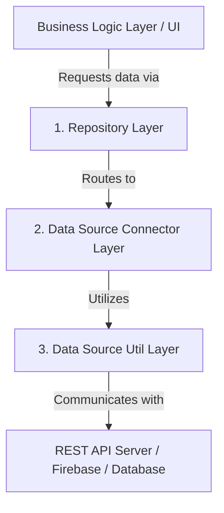

# Introduction to JoDija Repository

**English** | [النسخة العربية](../ar/introduction_ar.md)

## What is JoDija Repository?
`JoDija_reposatory` manages the data flow received from or sent to backend servers via REST APIs or cloud platforms like Firebase. It transforms data to align with domain business logic when displaying to users, or formats it as JSON when sending to servers, with centralized error handling and structured logging.

---

## Architectural Philosophy

The library is architected across three primary layers promoting separation of concerns, testability, and long-term maintainability:



### 1. Repository Layer
- **Purpose:** Acts as an intermediary between the application's business logic (View Models, Use Cases, BLoCs) and the data sources. It provides a clean, unified API for accessing data regardless of origin.
- **Responsibilities:**
  - Data abstraction and multi-source aggregation.
  - Consistent error handling wrapped in `Result` structures.
  - Shielding application UI from network and database modifications.

### 2. Data Source Connector Layer
- **Purpose:** Responsible for direct interaction with specific data sources (REST API endpoints or Firebase Firestore).
- **Responsibilities:**
  - Executing CRUD and Streaming operations.
  - Data mapping between JSON and `BaseEntityDataModel` entities.
  - Handling source-specific network/database errors.

### 3. Data Source Util Layer
- **Purpose:** Low-level utilities and helper classes utilized by connectors.
- **Examples:**
  - `HttpClient`: Executes network requests (GET, POST, PUT, DELETE, PATCH).
  - `HttpHeader`: Manages authentication tokens and language localization headers (`x-lang`).
  - `JDRepoConsole`: Structured logging, performance monitoring, and contextual debugging.
  - `FirebaseLoadingData` & `StorageActions`: Low-level Firestore and Storage helpers.

---

## Types of Application Solutions (Single vs Multi-Solution)

JoDija Repository was fundamentally architected around two core solution types:

### 1. Multi-Solution Applications (e.g. `matger front logic`)
- **Description:** Enterprise platforms comprising multiple frontends across different platforms (Customer Mobile App, Merchant App, Admin Web Dashboard, Courier App) that all share the same backend and business rules.
- **Architecture Layers:**
  1. **UI Client Solutions:** Platform-specific Flutter apps focusing exclusively on UI/UX.
  2. **Shared Business Logic Package (`matger front logic`):** Contains BLoCs, use cases, models, and extends `DataSourceConfigration`.
  3. **Core Data Module (`JoDija_reposatory`):** The foundational data access engine.
  4. **Unified Backend Server (`matger express`):** Single API server handling requests and returning standard response formats.
- **Key Advantage:** Business logic updates in `front logic` immediately apply to all client solutions without code duplication.

### 2. Single-Solution Applications
- **Description:** Standalone applications with a single frontend interface.
- **Architecture Layers:**
  - The UI app directly depends on `JoDija_reposatory`.
  - `DataSourceConfigration` is configured directly within the application package without requiring an intermediate logic package.

---

## Getting Started

### 1. Installation
Add `JoDija_reposatory` to your `pubspec.yaml`:

```yaml
dependencies:
  JoDija_reposatory:
    git:
      url: https://github.com/zeftawyapps/JoDija_reposatory.git
      ref: v1.7.0
```

### 2. Imports
```dart
import 'package:JoDija_reposatory/jodija_configration.dart';
import 'package:JoDija_reposatory/https/http_urls.dart';
import 'package:JoDija_reposatory/reposetory/repsatory.dart';
```

### 3. Configuration

#### A. In Multi-Solution Applications (via `matger front logic`):
Inside your shared logic package:

```dart
class LogicConfiguration extends DataSourceConfigration {
  Future<void> initLogic({
    required String configPath,
    required EnvType env,
    required BackendState backend,
    required AppType app,
    String defaultLang = 'ar',
  }) async {
    envType = env;
    backendState = backend;
    appType = app;

    await backendRoutedInit(configPath);
    HttpHeader().setLangHeader(lang: defaultLang);
  }
}
```

Then in `main.dart` of each UI solution:
```dart
void main() async {
  WidgetsFlutterBinding.ensureInitialized();
  await LogicConfiguration().initLogic(
    configPath: 'assets/config/config.json',
    env: EnvType.dev,
    backend: BackendState.remote_dev,
    app: AppType.App,
  );
  runApp(const MyApp());
}
```

#### B. In Single-Solution Applications:
Configure directly inside the application:
```dart
class AppConfiguration extends DataSourceConfigration {
  Future<void> init() async {
    envType = EnvType.dev;
    backendState = BackendState.remote_dev;
    appType = AppType.App;
    await backendRoutedInit('assets/config/config.json');
  }
}
```

---

## Related Documentation Guides

- [Integration Guide with Matger (matger front logic & matger express)](integration_matger_guide.md)
- [Configuration Classes Documentation](classes/configration.md)
- [Console & Logging Documentation (JDRepoConsole)](classes/utils/JDRepoConsole.md)
- [HTTP Error Handling Documentation](classes/utils/HttpErrors.md)
- [Comprehensive Class Summary](classes/class_summary.md)
